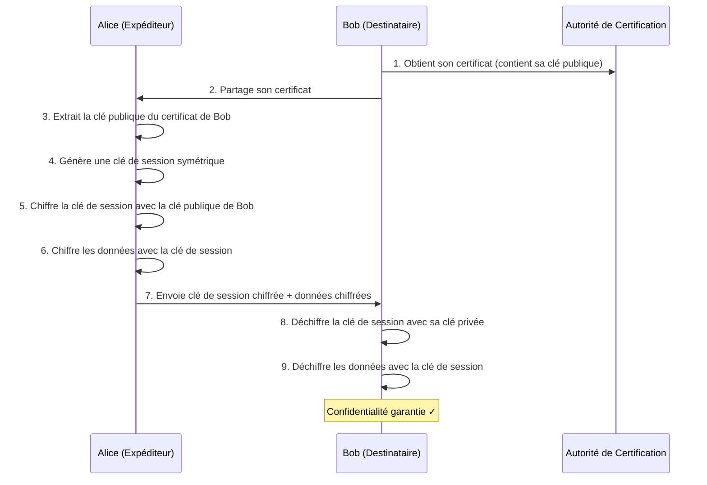
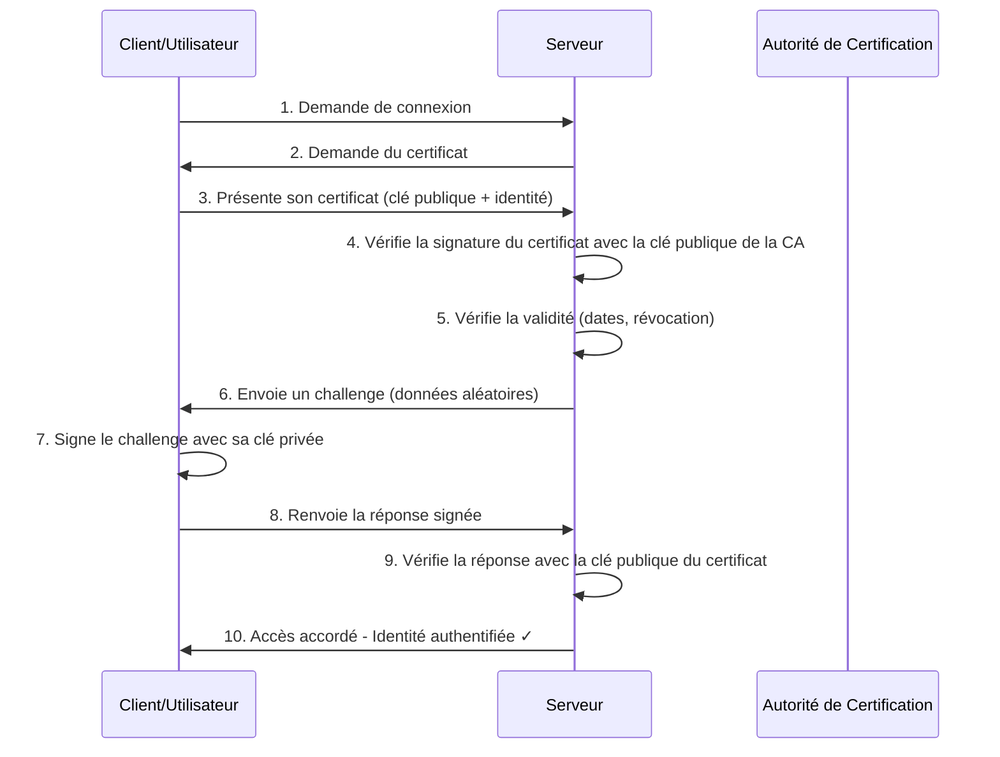
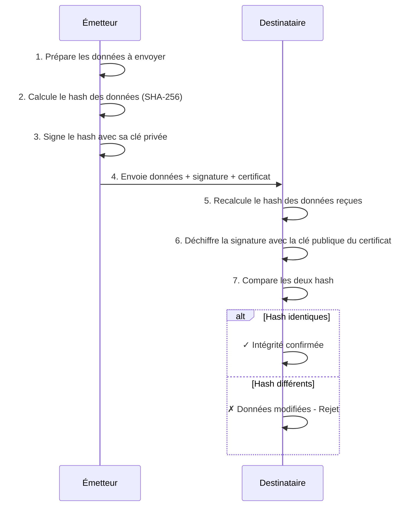
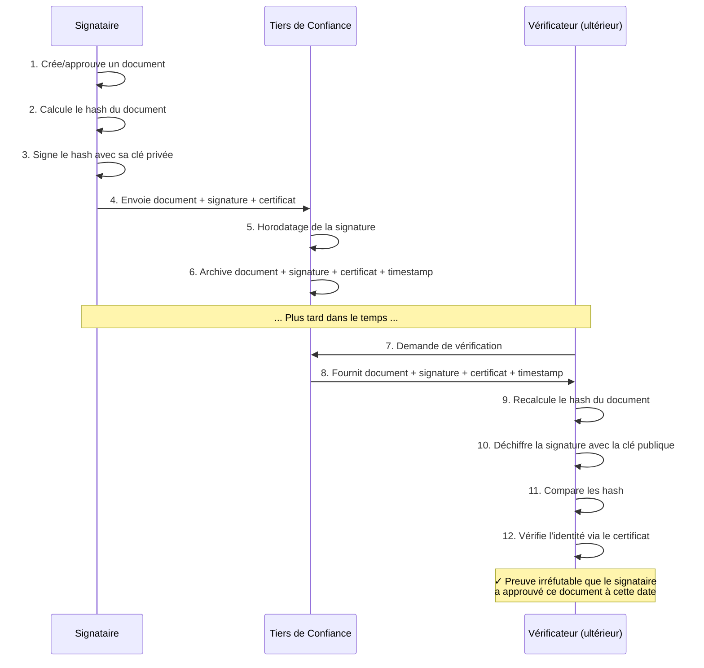

__2025-10-06 - Anthony COUDENE - Création_

# Objectif

L'objectif de cette solution .Net est d'exposer l'écosytème autour de la gestion des certificats.
On va découvrir une terminologie, différents cas d'utilisation du certificat, ainsi que des scripts pour les manipuler au sein de `Keycloak`.
La solution comporte un lanceur Aspire permettant d'exposer plusieurs usages du certificat avec du concret comme `Keycloak` et l'usage de `https` entre autres.

# Terminologie autour de la gestion des certificats

## Clés cryptographiques asymétriques

Les clés cryptographiques asymétriques (ou clés de chiffrement asymétriques) sont une paire de clés mathématiquement liées composée d'une clé publique et d'une clé privée. 
Ce qui est chiffré avec l'une ne peut être déchiffré qu'avec l'autre.

Elles ont plusieurs usages :

- Chiffrement/déchiffrement des données (confidentialité)
- Signature numérique et vérification (authenticité et intégrité)
- Échange de clés (génération de secrets partagés)
- Authentification (preuve d'identité)

## Clé privée

La clé privée est la partie secrète d'une paire de clés cryptographiques asymétriques. 
Elle doit rester strictement confidentielle et permet de déchiffrer les données chiffrées avec la clé publique correspondante, ainsi que de signer numériquement des documents ou des certificats.

## Clé publique 

La clé publique est la partie publique d'une paire de clés cryptographiques asymétriques. 
Contrairement à la clé privée qui doit rester secrète, la clé publique peut être librement distribuée et partagée.

## Certificat

Un certificat numérique (ou certificat électronique) est un document électronique qui lie une clé publique à l'identité d'une entité (personne, organisation, serveur, etc.). 
Il fonctionne comme une carte d'identité numérique.

Fonctions principales :

- Authentification : prouver l'identité d'une entité
- Chiffrement : permettre le chiffrement des communications
- Intégrité : garantir que les données n'ont pas été modifiées
- Non-répudiation : empêcher de nier une action (signature numérique)

## Autorité de certification (CA)

Une Autorité de Certification est une entité de confiance qui émet, gère et révoque des certificats numériques. 
Elle valide l'identité des demandeurs et signe leurs certificats avec sa propre clé privée. 
Les CA peuvent être publiques (comme DigiCert, Let's Encrypt) ou privées (internes à une organisation).

## Certificate Signing Request (CSR)

Un CSR est une demande formelle de certificat envoyée à une CA. 
Il contient la clé publique du demandeur et ses informations d'identification (nom, organisation, pays, etc.). 
Le CSR est signé avec la clé privée du demandeur pour prouver la possession de la clé correspondante.

## Signer un certificat

Signer un certificat consiste pour une CA à apposer sa signature numérique sur un certificat, attestant ainsi de l'authenticité des informations qu'il contient. 
Cette signature est créée en chiffrant un hash du certificat avec la clé privée de la CA, permettant à quiconque possède la clé publique de la CA de vérifier son authenticité.

## Keystore

Un keystore (magasin de clés) est un fichier ou une base de données sécurisée qui stocke des clés cryptographiques et leurs certificats associés. 
Il sert de conteneur protégé pour conserver vos identités numériques et secrets cryptographiques.

## Trustore

Un truststore est un fichier qui contient des certificats de CA de confiance. 
Il sert à vérifier l'authenticité des certificats présentés par des tiers. 
Contrairement au keystore qui contient vos propres clés privées, le truststore ne contient que des certificats publics d'autorités en lesquelles vous avez confiance.

## Format Fichier .crt

Le format .crt (certificate) est généralement un fichier contenant un certificat numérique au format X.509. 
Il peut être encodé en Base64 (format texte PEM) ou en binaire (format DER). 
Il contient uniquement le certificat public, sans la clé privée.

## Format Fichier .pem

Le format .pem (Privacy Enhanced Mail) est un format texte encodé en Base64, délimité par des marqueurs comme -----BEGIN CERTIFICATE----- et -----END CERTIFICATE-----. 
Un fichier .pem peut contenir un ou plusieurs certificats, des clés privées, ou les deux. 
C'est un format très répandu sur les systèmes Unix/Linux et dans les serveurs web.

## Format Fichier .pfx

Le format .pfx (Personal Information Exchange) est un format binaire PKCS#12 développé par Microsoft. 
Il peut contenir le certificat, la clé privée, et toute la chaîne de certification dans un seul fichier protégé par mot de passe. 
Très utilisé sous Windows.

## Format Fichier .p12

Le format .p12 est synonyme de .pfx et représente également le format PKCS#12. 
C'est le même type de conteneur qui regroupe certificats et clés privées dans un fichier sécurisé par mot de passe. 
L'extension .p12 est plus courante sur les systèmes Unix/Linux.

# Les 4 usages d'un certificat

Voici le fonctionnement détaillé de chaque fonction principale d'un certificat :

## Chiffrement : permettre le chiffrement des communications

### Principe

La clé publique contenue dans le certificat permet de chiffrer des données que seul le détenteur de la clé privée correspondante pourra déchiffrer.

### Fonctionnement



L'expéditeur récupère le certificat du destinataire (donc sa clé publique)
L'expéditeur utilise cette clé publique pour chiffrer les données ou (plus couramment) pour chiffrer une clé de session symétrique
Seul le destinataire, possédant la clé privée, peut déchiffrer
Dans les protocoles modernes comme TLS, on utilise un chiffrement hybride : la clé publique chiffre une clé symétrique, puis cette clé symétrique chiffre les données (plus rapide)

### Exemple concret

Lors d'une connexion HTTPS, votre navigateur utilise la clé publique du certificat du serveur pour établir une clé de session partagée de manière sécurisée. 
Toutes les données échangées ensuite sont chiffrées avec cette clé de session, garantissant la confidentialité.

## Authentification : prouver l'identité d'une entité

### Principe

Le certificat prouve que vous êtes bien qui vous prétendez être, car il a été émis et signé par une autorité de certification de confiance.

### Fonctionnement



- Une entité (serveur, utilisateur) présente son certificat contenant sa clé publique et ses informations d'identité
- Le vérificateur extrait la clé publique du certificat
- Le vérificateur vérifie que le certificat a bien été signé par une CA de confiance (en utilisant la clé publique de la CA)
- Le vérificateur vérifie la validité du certificat (dates, révocation, nom de domaine ou identité)
- Le vérificateur lance un défi (challenge) : il envoie des données aléatoires au détenteur
- Le détenteur prouve qu'il possède la clé privée correspondante en signant ou déchiffrant ce challenge
- Le vérificateur vérifie la réponse avec la clé publique du certificat
- Si tout est valide, l'identité est authentifiée

### Exemple concret

Lorsqu'un employé se connecte au VPN de son entreprise, le serveur VPN demande son certificat client. 
L'employé présente son certificat personnel émis par la CA interne de l'entreprise. 
Le serveur VPN vérifie que :

- Le certificat a bien été émis par la CA de l'entreprise (autorité de confiance)
- Le certificat contient les informations d'identité de l'employé (nom, matricule)
- Le certificat est valide (non expiré, non révoqué)
- L'employé possède bien la clé privée correspondante (en lui demandant de déchiffrer un challenge)

Ainsi, le serveur VPN authentifie l'employé et lui accorde l'accès aux ressources internes. 
C'est l'authentification par certificat, sans avoir besoin de mot de passe.

## Intégrité : garantir que les données n'ont pas été modifiées

### Principe

Le certificat, combiné avec les signatures numériques, permet de vérifier qu'un message ou fichier n'a pas été altéré pendant sa transmission ou son stockage.

### Fonctionnement



- L'émetteur calcule un hash (empreinte cryptographique) des données
- Il signe ce hash avec sa clé privée, créant une signature numérique
- Il envoie les données + la signature + son certificat
- Le destinataire recalcule le hash des données reçues
- Il déchiffre la signature avec la clé publique du certificat
- Si les deux hash correspondent, les données n'ont pas été modifiées

### Exemple concret

Quand vous téléchargez un logiciel signé numériquement, votre système d'exploitation vérifie la signature avec le certificat de l'éditeur. 
Si la signature est valide, cela garantit que le fichier n'a pas été altéré par un pirate depuis sa signature par l'éditeur.

## Non-répudiation : empêcher de nier une action

### Principe

La signature numérique avec un certificat crée une preuve infalsifiable qu'une action a été effectuée par une entité spécifique à un moment donné. 
L'émetteur ne peut pas nier avoir effectué cette action.

### Fonctionnement



- L'utilisateur signe un document/transaction avec sa clé privée (qui est supposée n'être connue que de lui)
- La signature est horodatée
- Le certificat lie la clé publique à l'identité vérifiée de l'utilisateur
- La signature peut être vérifiée à tout moment avec la clé publique du certificat
- Puisque seul le détenteur de la clé privée peut créer cette signature, il ne peut pas nier l'avoir faite

### Exemple concret

Dans un système de signature électronique de contrats, lorsque vous signez numériquement un document PDF avec votre certificat personnel, cette signature constitue une preuve juridique que vous avez bien approuvé ce document. 
Vous ne pouvez pas ensuite prétendre ne jamais l'avoir signé, car seule votre clé privée pouvait créer cette signature valide.

## Résumé des relations :

Chiffrement : "Personne d'autre ne peut lire ce message"
Authentification : "Tu es bien qui tu prétends être"
Intégrité : "Le message n'a pas été modifié"
Non-répudiation : "Tu ne peux pas nier avoir fait cette action"

Ces quatre fonctions sont souvent utilisées ensemble dans les protocoles de sécurité modernes pour garantir une communication totalement sécurisée.

# 🔧 Étapes pour générer un certificat utilisateur de test

## 1. Générer une autorité de certification (CA) locale

```
# Clé privée de la CA
openssl genrsa -out rootCA.key 4096

# Certificat auto-signé de la CA (valable 10 ans)
openssl req -x509 -new -nodes -key rootCA.key -sha256 -days 3650 -out rootCA.crt \
  -subj "/C=FR/ST=AURA/L=GRENOBLE/O=MYORG/OU=R&D/CN=myorg"
```

👉 Le fichier rootCA.crt sera importé comme autorité de confiance dans Keycloak (et éventuellement dans ton navigateur, si ce n’est pas déjà reconnu).

## 2. Générer la clé et CSR (Certificate Signing Request) pour l’utilisateur

```
# Clé privée utilisateur
openssl genrsa -out anthony.key 2048

# CSR utilisateur
openssl req -new -key anthony.key -out anthony.csr \
  -subj "/C=FR/ST=AURA/L=GRENOBLE/O=MYORG/OU=R&D/CN=anthony/emailAddress=anthony.coudene@technidata-web.com"
```

## 3. Signer le certificat utilisateur avec ta CA

```
openssl x509 -req -in anthony.csr -CA rootCA.crt -CAkey rootCA.key -CAcreateserial \
  -out anthony.crt -days 365 -sha256
```

👉 Tu as maintenant anthony.crt signé par ta CA locale.

## 4. Créer un fichier PFX pour import dans le navigateur

Les navigateurs veulent souvent un PKCS#12 (.p12 ou .pfx) contenant le certificat et la clé privée :

```
openssl pkcs12 -export -out anthony.pfx -inkey anthony.key -in anthony.crt -certfile rootCA.crt
```

ou P12

```
openssl pkcs12 -export -out anthony.p12 -inkey anthony.key -in anthony.crt -certfile rootCA.crt
```

Il te sera demandé un mot de passe → saisis-en un simple (ex. test123).

## 5. Générer le Host Certificate (https)


```
openssl req -new -newkey rsa:4096 -keyout localhost.key -out localhost.csr -nodes -subj "/C=FR/ST=AURA/L=GRENOBLE/O=MYORG/OU=
R&D/CN=localhost/emailAddress=anthony.coudene@technidata-web.com"
```

## 6. Signer le certificat localhost avec ta CA

Ecrire un fichier localhost.ext ou selon le nom du host :

```
authorityKeyIdentifier=keyid,issuer
basicConstraints=CA:FALSE
subjectAltName=@alt_names
[alt_names]
DNS.1=localhost
```

Puis signer le certificat :

```
openssl x509 -req -CA rootCA.crt -CAkey rootCA.key -in localhost.csr -out localhost.crt -days 365 -CAcreateserial -extfile localhost.ext
```

## 7. Créer un fichier pem pour le host certificate

```
openssl x509 -in localhost.crt -out localhost-crt.pem -outform PEM
```

Puis 

```
openssl rsa -in  localhost.key -out localhost-key.pem
```

## 8. Créer un truststore pour le host certificate

```
keytool -import -alias localhost -file rootCA.crt -keystore truststore.jks -storepass password
```

## 9. Importer le certificat dans ton navigateur

Chrome / Edge / Brave :

Paramètres → Confidentialité et sécurité → Sécurité → Gérer les certificats → Onglet Personnel → Importer `anthony.pfx`.

Firefox :

Préférences → Vie privée et sécurité → Certificats → Afficher les certificats → Onglet Vos certificats → Importer `anthony.pfx`.

Safari (macOS/iOS) : double-clique sur `anthony.pfx`, il sera ajouté au trousseau d’accès.

## 10. Importer la CA dans Keycloak

Dans Keycloak, configuration TLS mutualisé → tu dois indiquer que `rootCA.crt` est une CA de confiance pour vérifier les certificats utilisateurs.

Selon ton déploiement :

Si c’est Keycloak direct → configurer truststore côté Quarkus.

Si c’est via un proxy (NGINX/Traefik) → configure le proxy pour faire confiance à ca.crt et exiger un certificat client.

# Tests

## Direct authentication

https://localhost:8443/realms/mytenant/protocol/openid-connect/auth?client_id=authenticationCertificateApp&response_type=code&redirect_uri=https://mytenant.localhost.com:5002

# Références

https://medium.com/@sangeethapl.sai/keycloak-x509-certificate-based-login-e9101f4a9922
