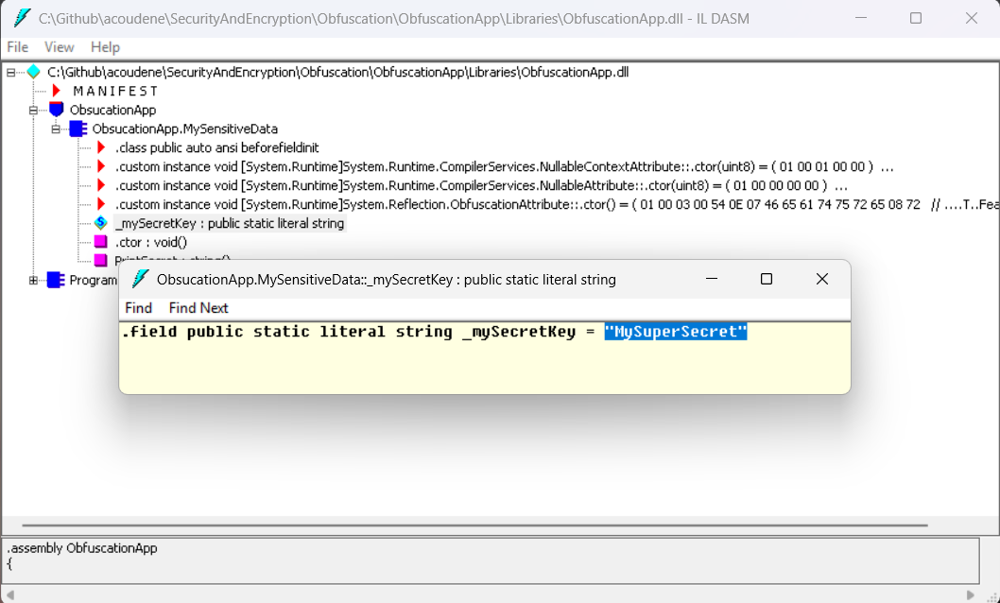
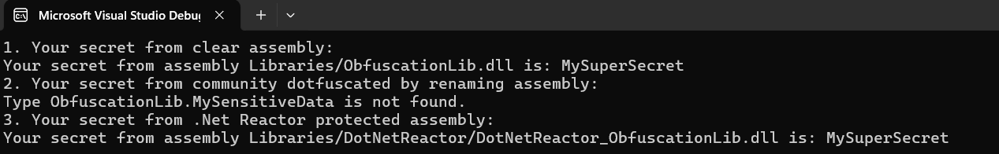
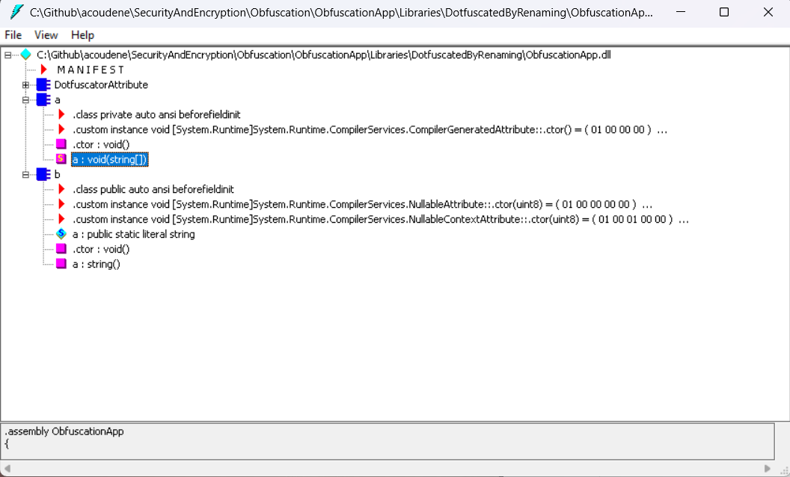
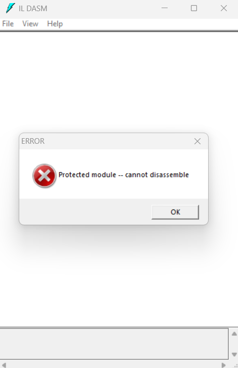

# Obfuscation

Use this app to test obfuscation.
For the moment, it uses DotFuscator Community and Professional (trial one).

# Objective

Put difficulties to get this secret value:

```csharp
public class MySensitiveData
{
  public const string _mySecretKey = "MySuperSecret";

  public string PrintSecret()
  {
    return $"The secret key is: {_mySecretKey}";
  }
}
```

The program load code, clear assembly, and obfuscate version of it, by renaming and then by encryption.



# Output



# Dotfuscator 

## Community Edition

Just do renaming of the members and types.



## Professional Edition

Do encryption of the members and types.
Problem here. Professional edition does not work on my computer.

# .Net Reactor



# C++ use case

Try to look at a secret string in C++ code (dumpbin is a Visual Studio CLI tool)

```cmd
dumpbin /all ObfuscationLib_cpp.dll | findstr "MySuperSecret"
```

C++ is not obfuscated, but it is compiled to native code.

# References

- Article on Obfuscator tools: https://blog.ndepend.com/in-the-jungle-of-net-obfuscator-tools/
- Dotfuscator: https://www.preemptive.com/products/dotfuscator/overview
- .Net Reactor: https://www.eziriz.com/dotnet_reactor.htm
